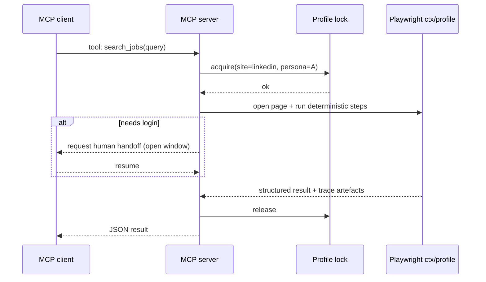

# Local-first authenticated browser automation and deterministic MCP-style adapters

## Executive summary

If you want **local-first**, **authenticated**, **reliable** browser automation without paying LLM “token tax”, the market reality is blunt: **Playwright and Puppeteer are still the only truly battle-tested deterministic cores**. Everything else is either (a) orchestration around them, (b) MCP plumbing, or (c) stealth/anti-detection patching that is inherently fragile and policy-sensitive. citeturn7view0turn8view0turn32search0turn22search0

For *authenticated* automation, the key primitives are now well-understood and widely reusable:

- **Persistent profiles (`userDataDir` / persistent contexts)** when you want “be the user” (cookies, extensions, local state). citeturn32search0turn22search0turn34view0  
- **Portable storage snapshots (“storage state”)** when you want deterministic runs, CI/CD compatibility, and easy rotation/rollback. citeturn21search1turn34view0  
- **Attach-to-running-browser (CDP / WS)** for the cleanest human hand-off (login + 2FA done by a human once, automation attaches afterwards). citeturn21search0turn22search1turn34view3turn16view1  

On the MCP side, you have two strong paths:
- Use the **official MCP Python SDK** (which includes FastMCP) to build **deterministic site adapters** with lifecycle hooks and proper transports. citeturn19view2turn20view2  
- Or start from **high-star MCP browser servers** (e.g., Playwright MCP, Chrome DevTools MCP) and narrow them down into “safe, deterministic tools” per site. citeturn30view2turn26view3turn25view3  

The “AI-native” frameworks (Browser Use, Stagehand) are useful for prototyping and for handling highly volatile UI, but they **require** (or strongly assume) an LLM at runtime; and you should treat their auth persistence stories as “helpful, but not your source of truth”. In particular, Stagehand’s local persistence has had real regressions reported (userDataDir not persisting; storageState absent in v3), so for **reliable auth management** you still want to own the Playwright-level primitives yourself. citeturn34view0turn30view0turn33view0turn16view1  

## Evaluation criteria for a local-first authenticated framework

A local-first authenticated automation framework that is “deterministic enough to test” typically needs these layers:

- **Auth/session primitives**
  - Persistent profile directory (Chromium user data dir, or Playwright persistent context). citeturn32search0turn22search0turn16view1turn19view1  
  - Storage snapshot export/import (“storage state”; cookies + localStorage + optionally IndexedDB). citeturn21search1turn34view0  
  - Attach to an existing browser instance via **CDP** (local debug port / WS URL), so a human can log in once and the system reuses it. citeturn21search0turn22search1turn34view2turn16view1  

- **2FA + human handoff**
  - Explicit “open browser for login” flows and a way to pause/continue. (LinkedIn MCP server does this with `--login`.) citeturn19view1  
  - 2FA hooks: TOTP/email/SMS capture or at least a structured pause/resume flow. (Browser Use documents these explicitly.) citeturn34view0  

- **Concurrency + safety**
  - Per-profile **locking** (one automation process touching one profile at a time), plus queuing. (LinkedIn MCP server serialises tool calls for a shared session.) citeturn19view1turn18search1  
  - Isolation strategy: “one profile per persona” + “one context per job” when possible. citeturn32search0turn21search1  

- **Observability and replay**
  - Trace/log/replay tooling matters more than “AI cleverness” when you want reliability:
    - Playwright Trace Viewer for action-by-action debugging. citeturn21search2  
    - Chrome DevTools MCP can record traces and expose DevTools-level debugging to agents/tools. citeturn26view3turn27search7  
    - Puppeteer Replay replays DevTools Recorder recordings (useful for capturing a baseline flow). citeturn22search2  

- **Stealth / anti-detection (optional, risky)**
  - Patched drivers (Patchright) and patch sets (rebrowser-patches) exist and can materially reduce trivial detection signals, but they are not stable “APIs”; they are moving targets. citeturn13view0turn11view1turn12view1  
  - Firefox-side anti-fingerprinting stacks (Camoufox / camofox-browser) are powerful but add operational complexity and different compatibility constraints. citeturn11view2turn25view2turn26view2  

## Project landscape and what each is good for

The ecosystem (as of 2026‑03‑22) splits cleanly into five buckets:

Deterministic browser automation cores:
- **Playwright** (by entity["company","Microsoft","software company"]) has the strongest “auth-state + trace + cross-browser” story: `storageState()`, `launchPersistentContext(userDataDir)`, and `connectOverCDP()` cover the three major auth approaches. citeturn7view0turn21search1turn32search0turn21search0  
- **Puppeteer** (by entity["company","Google","tech company"] / the Puppeteer project) is the most direct Chrome/CDP-centric option: `userDataDir` + `browser.wsEndpoint()` support classic “start once, attach many times” patterns. citeturn8view0turn22search0turn22search1  

Automation orchestration & queueing:
- **Crawlee** (by entity["company","Apify","web scraping platform company"]) gives you production-grade primitives for pooling browsers, rotating sessions/cookies, and queueing URLs/tasks; it supports Playwright and Puppeteer via `@crawlee/browser-pool`, plus `SessionPool` and `RequestQueue`. citeturn10view2turn31search2turn31search3turn31search1  
- **puppeteer-cluster** is a straightforward parallelism/pool library for Puppeteer; it’s a useful building block if you stay in the Puppeteer world. citeturn10view1turn4view1  

MCP plumbing (SDK/framework):
- The official **MCP Python SDK** (originating with entity["company","Anthropic","ai company"]) provides transports (stdio/SSE/Streamable HTTP), lifecycle hooks, and includes FastMCP examples. citeturn19view2turn18search6  
- **FastMCP** (standalone, by entity["company","Prefect","workflow orchestration company"]) emphasises ergonomics: generate schemas/validation, manage transport negotiation and auth. citeturn19view3turn20view3turn18search7  

MCP “browser servers” (you can adapt or learn from):
- **Playwright MCP** is a high-star reference MCP server for Playwright-driven browsing with structured snapshots. citeturn30view2turn35search10  
- **Chrome DevTools MCP** is a high-star MCP server that lets tools/agents control a live Chrome and use DevTools (traces, network, console) for reliability and debugging. citeturn26view3turn25view3turn27search7  
- **linkedin-mcp-server** is a concrete “site-specific adapter” showing exactly the pattern you described: persistent profile dir, explicit login flow, queued tool execution behind a single shared session. citeturn19view1turn30view3turn18search5  

Stealth / anti-detection layers (optional and sensitive):
- **Patchright** is a patched Playwright intended as a drop-in replacement for Chromium-based targets. citeturn13view0turn12view0  
- **rebrowser-patches** is a patch set for Puppeteer/Playwright, with “drop-in” patched packages (rebrowser-*). citeturn11view1turn12view1  
- **puppeteer-extra** + stealth plugin is the classic plugin route: it’s explicitly framed as a “cat and mouse” game, which is accurate. citeturn41view0turn40search1  
- **Camoufox** (MPL) and **camofox-browser** (MIT) target deeper fingerprint spoofing on the Firefox side and provide Playwright-compatible entry points / an agent-oriented server. citeturn11view2turn13view3turn25view2turn26view2  
- **nodriver** and **zendriver** are CDP-first “undetected” Python stacks with strong claims, but their AGPL licensing can be a hard stopper depending on your distribution model. citeturn11view3turn12view3turn12view4turn13view1  

## Comparison table of relevant open-source projects

The table below is optimised for “what role should this play in my stack?” and explicitly flags local-first/auth primitives/persistence/LLM coupling and risks.

| name | local-first? | auth primitives | persistence | stealth | LLM-dependence | recommended role in stack | notes/risks |
|---|---:|---|---|---|---|---|---|
| Playwright | yes | `launchPersistentContext(userDataDir)`; `storageState()`; `connectOverCDP()` | profile dir + storage snapshots | none by default | none | deterministic core | Apache‑2.0; ~64.7k★; latest v1.58.2 (2026‑02‑06). Also warns that automating default Chrome user profile may fail; use a separate automation profile dir. citeturn7view0turn32search0turn21search1turn32search1turn21search0 |
| Puppeteer | yes | `userDataDir`; `wsEndpoint()` + `connect()` | profile dir | none by default | none | deterministic core (Chrome-first) | Apache‑2.0; ~93.9k★; latest 24.4.0 (2026‑03‑19). Strong “start once / attach later” ergonomics. citeturn8view0turn22search0turn22search1 |
| Crawlee | yes (hybrid storage) | SessionPool (cookies/proxy session); integrates with Playwright/Puppeteer | RequestQueue can store locally (or cloud); SessionPool persistence | not a stealth library per se | none | queueing + pooling + session rotation | ~22.5k★; latest v3.16.0 (2026‑02‑06); TS-heavy. Best if you need concurrency, retries, backoff, stateful crawling. citeturn10view2turn31search3turn31search1turn31search2 |
| puppeteer-cluster | yes | inherits Puppeteer auth primitives | depends on your implementation | none | none | parallel execution/pool | MIT; ~3.5k★. Solid basic pooling; less “session semantics” than Crawlee. citeturn10view1turn4view1 |
| SeleniumBase | yes | WebDriver + CDP mode (can drive Chromium via CDP APIs); “UC mode” | browser profile support depends on Selenium/driver config | explicit stealth modes (“UC Mode”, “CDP Mode”) incl. “Stealthy Playwright Mode” | none | Python convenience layer + stealthy modes | MIT; ~12.5k★; many releases (latest shown 2026‑03‑17). Strong for “rapid scripting with batteries included”, but it’s a bigger abstraction. citeturn10view0turn9view0 |
| Patchright | yes | Playwright-compatible API; uses patched Chromium-based browsers | user profiles like Playwright; includes patched browser downloads | high (patched) | none | optional stealth drop-in under Playwright | Apache‑2.0; ~2.7k★; latest v1.58.0 (2026‑03‑07). Chromium-only; operationally heavier than vanilla Playwright. citeturn13view0turn12view0 |
| rebrowser-patches | yes (as patch tooling) | patches Playwright/Puppeteer code to reduce leaks | depends on underlying lib | high (patch set) | none | patch layer (Node) | ~1.3k★; latest release shown 2025‑05‑09; JS-only. Explicitly warns patching is fragile as upstream changes. citeturn11view1turn12view1 |
| rebrowser-playwright | yes | drop-in patched Playwright | same as Playwright | high (patched) | none | patched Playwright package (Node) | Repo main branch is mostly metadata; code in version branches; stars low (48★) but ties to rebrowser-patches concept. Treat as “use if you already trust the patch set.” citeturn29view0turn12view1 |
| puppeteer-extra | yes | Puppeteer-compatible; plugin ecosystem | depends on Puppeteer primitives + plugins | medium–high via stealth plugins | none | stealth plugin framework (Puppeteer) | MIT; ~7.3k★; JS/TS; no GitHub “releases” but many tags. Stealth plugin explicitly frames a cat-and-mouse dynamic; expect breakage. citeturn41view0turn40search1 |
| Playwright-Stealth (Granitosaurus) | yes | Playwright page-level stealth scripts | none beyond Playwright | low–medium (scripts) | none | lightweight helper | ~146★; no declared licence file visible in repo; treat as legally unclear for reuse. citeturn28view0turn25view0 |
| Camoufox | yes | Playwright-compatible API surface; fingerprint injection/rotation | depends on your launch/profile choices | very high (C++-level spoofing) | none | specialised anti-detection engine | MPL‑2.0; ~6.3k★. Maintainer notes a maintenance gap and performance regression; also notes limits spoofing Chromium fingerprints. citeturn12view2turn13view3turn11view2 |
| camofox-browser | yes (server; can be local) | server wraps Camoufox; session reuse depends on server design | server-managed | very high | optional (tool server can be non-LLM) | isolate “hard sites” into a dedicated browser server | MIT; ~876★; latest v1.4.0 (2026‑03‑09). Explicitly claims “stealth plugins become the fingerprint” and positions itself as a server for agents. citeturn25view2turn26view2 |
| BrowserForge | yes | N/A (fingerprint/header generator) | N/A | medium (fingerprint/header synthesis) | none | generate plausible headers/fingerprints | Apache‑2.0; ~1k★. Useful when you control HTTP headers, less so for pure in-browser JS fingerprinting. citeturn11view5turn12view5 |
| nodriver | yes | CDP-first; avoids WebDriver | state handling is library-specific | high (undetected-focused) | none | alternative core (Python CDP) | AGPL‑3.0; ~3.9k★; “successor of undetected-chromedriver”; no releases. Licensing may block commercial embedding. citeturn11view3turn12view3turn13view1 |
| zendriver | yes | CDP-first; fork of nodriver | library-specific; Docker examples exist | high | none | alternative core (Python CDP) | AGPL‑3.0; ~1.2k★; latest v0.15.3 (2026‑03‑12). Same licensing concern as nodriver. citeturn11view4turn12view4 |
| Browser Use (open-source) | yes | “Real Browser” profile reuse; storage state; 2FA strategies | auto-save/load storage state; CDP connect | not the focus | required (runtime decision-making) | LLM-driven fallback + auth cookbook | MIT; ~81.9k★; latest 0.12.3 (2026‑03‑20). Strong auth guide: real browser profiles + storage state + TOTP/email/SMS 2FA; also supports sharing CDP with Playwright. citeturn30view1turn34view0turn34view2turn34view3 |
| Stagehand | partial (local supported) | `userDataDir`; `cdpUrl` attach; keepAlive; browserbase session resume | intended to support profiles; real-world regressions reported | not a stealth product | required (designed around LLM actions) | LLM-assisted automation layer | MIT; ~21.7k★; latest 3.2.0 (2026‑03‑18). A reported v3 issue says `userDataDir`/`preserveUserDataDir` didn’t persist and `storageState()` was missing, breaking auth persistence. citeturn30view0turn16view1turn33view0 |
| MCP Python SDK | yes | server lifecycles, transports, schemas | N/A | N/A | none (MCP plumbing) | build deterministic MCP servers | MIT; ~22.2k★; latest v1.26.0 (2026‑01‑24). Includes FastMCP server patterns and Streamable HTTP transport support. citeturn20view2turn19view2turn18search6 |
| FastMCP (standalone) | yes | tool declaration + schema/validation; transports + auth | N/A | N/A | none | fast server framework | Apache‑2.0; ~23.9k★; latest v3.1.1 (2026‑03‑14). Also states FastMCP was incorporated into official MCP Python SDK earlier. citeturn20view3turn19view3turn18search7 |
| Playwright MCP | yes | Playwright-driven tools via MCP | depends on Playwright config | none | typically used by LLM clients | baseline MCP “browser server” (customise down) | Apache‑2.0; ~29.4k★; latest v0.0.68 (2026‑02‑14); TS. Useful reference, but for deterministic adapters you’ll want to constrain its tool surface. citeturn30view2turn35search10 |
| Chrome DevTools MCP | yes | attaches to live Chrome; DevTools trace + debugging | depends on Chrome profile you connect to | none (focus is debugging/automation) | optional | “attach + inspect + automate” MCP server | Apache‑2.0; ~30.7k★; latest v0.20.3 (2026‑03‑20). Key feature: DevTools traces + reliable automation (via Puppeteer) for debugging/perf. citeturn26view3turn25view3turn27search7 |
| linkedin-mcp-server | yes | explicit `--login` flow; persistent `--user-data-dir`; single-session lock | persistent profile dir; caches managed browsers | uses Patchright downloads; “stealth-ish” by dependency | none | best reference for site-specific deterministic adapter | Apache‑2.0; ~1.1k★; latest v4.5.2 (2026‑03‑21); tool calls serialised so concurrent requests queue; good blueprint for your framework. citeturn19view1turn20view1turn30view3 |
| Browserbase MCP server | no (cloud-first) | contexts + server-managed sessions | cloud contexts persist user data | includes stealth modes (some plan-gated) | typically yes (Stagehand model) | cloud comparative baseline | Apache‑2.0 repo; ~3.2k★; implements tools like `act/extract/observe` and supports context persistence flags; but it’s fundamentally aimed at cloud sessions. citeturn17view2turn20view0turn17view0turn17view1 |
| JovaniPink/mcp-browser-use | yes | env-configurable browser session factory (incl. persistent sessions) | supports persistent profiles via config | inherits from browser-use | required (browser-use) | example MCP wrapper + config patterns | ~58★; Python; no licence shown on repo page (treat as “not clearly licensed” unless confirmed). Strong documentation pattern: configuration + security docs; mentions persistent profiles and Chromium flags. citeturn36view0turn38view2turn37view1 |
| Saik0s/mcp-browser-use | yes | HTTP daemon for long tasks; MCP tool surface | daemonised service improves reliability | inherits from browser-use | required | “operationalised” Browser Use MCP wrapper | MIT; ~914★; argues stdio timeouts for 30–120s browser tasks and uses HTTP daemon + UI/observability. citeturn36view1turn37view2turn37view3 |

## Ranked shortlist for a local-first Playwright-based stack

If you’re building an open-source “adapter framework” (not “one-off scrapers”), these are the six I’d anchor on, in this order:

1) **Playwright** — the deterministic, testable execution core; best auth primitives (storage state + persistent contexts + CDP attach) and best debugging story (traces). citeturn32search0turn21search1turn21search2turn21search0  

2) **MCP Python SDK (FastMCP)** — the cleanest way to expose *your deterministic adapters* as MCP tools with lifecycle and transport support (stdio / Streamable HTTP). citeturn19view2turn20view2  

3) **Chrome DevTools MCP** — the strongest “attach to a real logged-in browser and inspect what’s happening” tool; doubles as an observability/debug layer (traces, network, console). citeturn26view3turn25view3turn27search7  

4) **Crawlee (selectively)** — not because you must use Node, but because it’s the most mature, reusable set of patterns for **queueing + session rotation + browser pooling**. Even if you re-implement in Python, it’s the best reference. citeturn31search3turn31search1turn31search2turn10view2  

5) **linkedin-mcp-server** — treat it as a reference implementation of your target architecture: persistent profile dir + explicit login handoff + per-session locking/queueing + a constrained tool surface. citeturn19view1turn30view3turn18search5  

6) **Patchright or Camoufox (only if you genuinely need it)** — use as an optional “hard-sites runtime” behind the same adapter interface. Patchright is closer to Playwright; Camoufox/camofox-browser is a different engine with stronger fingerprint claims but higher complexity and different constraints. citeturn13view0turn11view2turn25view2turn13view3  

## Concrete integration blueprint for deterministic MCP-style adapters

### Reference architecture

```mermaid
flowchart LR
  A[MCP client\n(IDE/assistant)] -->|tool call| B[MCP server\n(FastMCP / MCP Python SDK)]
  B --> C[Adapter registry\n(site-specific tools)]
  C --> D[Browser manager]
  D -->|launchPersistentContext\nor connectOverCDP| E[Playwright]
  D --> F[Auth vault\n(storage_state + profile dirs)]
  D --> G[Lock manager\n(per profile/site)]
  D --> H[Observability\n(traces, screenshots, logs)]
```

Key idea: **your “framework” is the Browser manager + Auth vault + Lock manager + Observability**, and each site adapter is “just deterministic code” running on top. That’s exactly what the LinkedIn MCP server demonstrates (persistent `--user-data-dir`, explicit login, serialised calls). citeturn19view1turn18search1  

### Minimal Playwright auth patterns you can lift directly

**Pattern A: persistent profile per persona (best for “run as the user”)**

- Use `launchPersistentContext(userDataDir)` to keep cookies/local state on disk. citeturn32search0  
- Do **not** point it at your default Chrome profile directory; Playwright explicitly warns this may break due to Chrome policy changes. Use a dedicated automation profile dir. citeturn32search1  

```python
# Deterministic profile-based auth using Playwright (Python)
import pathlib
from playwright.sync_api import sync_playwright

PROFILE_DIR = pathlib.Path.home() / ".myframework" / "profiles" / "linkedin_persona_1"
PROFILE_DIR.mkdir(parents=True, exist_ok=True)

def run_headful_login_then_close():
    with sync_playwright() as p:
        context = p.chromium.launch_persistent_context(
            user_data_dir=str(PROFILE_DIR),
            headless=False,
        )
        page = context.new_page()
        page.goto("https://www.linkedin.com/")
        # Human completes login + any 2FA in the visible window.
        page.wait_for_timeout(120_000)
        context.close()
```

**Pattern B: portable storage snapshot for deterministic runs**

- `browserContext.storageState()` returns cookie/localStorage/IndexedDB snapshots. citeturn21search1  
- Browser Use explicitly uses Playwright’s storage state JSON format and even auto-saves/merges it. citeturn34view0  

```python
# Export/import storage state (portable "auth.json")
import json
from playwright.sync_api import sync_playwright

AUTH_FILE = "auth.json"

def export_storage_state():
    with sync_playwright() as p:
        browser = p.chromium.launch(headless=False)
        ctx = browser.new_context()
        page = ctx.new_page()
        page.goto("https://example.com/login")
        page.wait_for_timeout(120_000)  # human login + 2FA
        ctx.storage_state(path=AUTH_FILE)
        browser.close()

def run_with_storage_state():
    with sync_playwright() as p:
        browser = p.chromium.launch(headless=True)
        ctx = browser.new_context(storage_state=AUTH_FILE)
        page = ctx.new_page()
        page.goto("https://example.com/protected")
        # deterministic steps...
        browser.close()
```

### “Very reliable” MCP adapter patterns you should copy

**Per-profile single-writer locking + queueing**

- The LinkedIn MCP server explicitly serialises tool calls “to protect the shared LinkedIn browser session” so concurrent requests queue instead of racing. citeturn19view1turn18search1  
- Crawlee’s worldview is similar but at a crawler scale: `RequestQueue` and `BrowserPool` are explicit primitives for managing work and bounding concurrency. citeturn31search1turn31search2  

A minimal equivalent in your framework is: one mutex per `(site, persona)` and “time-boxed tools” that can be retried.



**Observability as a first-class artefact**

- Playwright traces are designed for debugging “after the script has run”, especially in CI. citeturn21search2  
- Chrome DevTools MCP also positions tracing + DevTools introspection as core functionality. citeturn26view3turn27search7  

In practice: every tool run should emit (locally):
- a trace (Playwright),  
- a final screenshot,  
- HTML snapshot or accessibility snapshot (whichever you standardise),  
- a structured timing log.

### How to incorporate LLM-based tools without making them your runtime dependency

If your core product thesis is “deterministic adapters”, the clean way to use Browser Use / Stagehand is:

- Keep **LLM-based browsing as a fallback tool**: “try deterministic adapter first; if selectors broke, use LLM agent to recover and propose a patch PR.”  
- Browser Use explicitly supports sharing a Chrome instance via CDP with Playwright and letting the agent call Playwright functions for deterministic steps. That is exactly the hybrid you want (AI assists, code executes). citeturn34view2turn34view3  

Be cautious about Stagehand auth persistence if you depend on `userDataDir` in local mode; a real bug report indicates this broke in Stagehand v3.0.1 and even removed `storageState()` availability off the exposed objects. citeturn33view0turn16view1  

## Practical risks and “don’t get cute” notes

- **Auth persistence is security-sensitive.** Browserbase’s “contexts” doc is explicit that persisted user data can include credentials and must be handled securely (they mention encryption at rest in their system). Your local equivalent needs a threat model: filesystem permissions, optional encryption, and never exposing control endpoints to untrusted clients. citeturn17view0turn38view2  

- **Stealth/anti-detection is an arms race.** Even the mainstream stealth plugin ecosystem describes it as a cat-and-mouse game. Don’t architect your framework assuming stealth patches are stable; treat them as swappable backends with aggressive smoke tests. citeturn40search1turn11view1  

- **Licensing can kill reuse.** nodriver and zendriver are AGPL‑3.0; that’s not a detail you can “deal with later” if you distribute a combined work. citeturn12view3turn12view4  

- **Default Chrome profile automation is getting harder.** Playwright’s docs warn that automating the default Chrome user profile is not supported due to Chrome policy changes; you’ll want dedicated automation profiles or CDP attach flows that don’t fight the policy. citeturn32search1turn34view0  

- **Cloud-first products are not your “local-first” foundation.** Browserbase provides useful reference concepts (contexts, session recording/logging, stealth modes, MCP server ergonomics), but its core value is cloud infrastructure and plan-gated stealth features; reuse the ideas, not the dependency, if local-first is a hard requirement. citeturn17view0turn17view1turn17view2